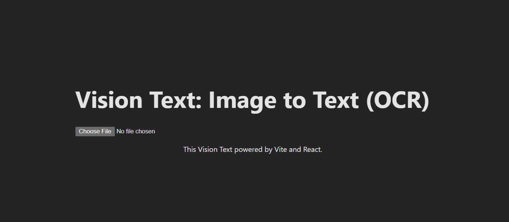
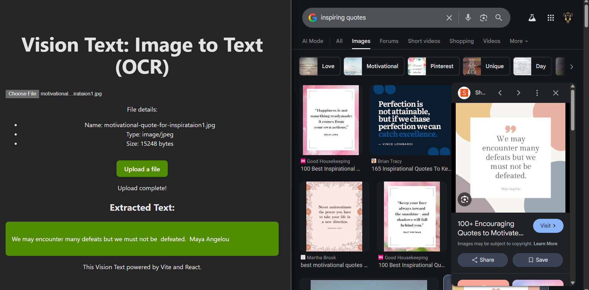

# Vision Text OCR UI

This project is the frontend user interface for the Vision Text OCR Service. A 
service that captures text from images. See backend service [here](https://github.com/hartake/vision-text-ocr-service)

## Purpose

This application provides a simple web interface for users to upload an image file. It sends the image to the backend OCR service, which extracts any text from the image and returns it to be displayed on the screen.

## Core Technology Stack

- **React:** A JavaScript library for building user interfaces.
- **Vite:** A modern, fast frontend build tool and development server.
- **JavaScript (JSX):** The language used for the components.
- **CSS:** For styling the application.

## Architecture

This UI is the frontend component of a client-server decoupled full-stack application. It acts as the dedicated client-side application for the `vision-text-ocr-service` backend, which handles the core business logic and data persistence. 

## Set up

1.  **Prerequisites**: Make sure you have [Node.js](https://nodejs.org/) and [npm](https://www.npmjs.com/) installed.
2.  **Install**:
    ```sh
    cd vision-text-ui && npm install
    ```

## Start & Build Commands

-   `npm run dev`: Starts the development server.
-   `npm run build`: Builds the app for production.
-   `npm run preview`: Serves the production build locally.

## Running with Docker (Recommended)

For a consistent and isolated development environment, you can build and run this project using Docker. This is the recommended way to run the application locally without needing to install Node.js or npm on your host machine.

1.  **Prerequisites**: Make sure you have [Docker](https://www.docker.com/products/docker-desktop/) installed and running.
2.  **Build the Image**: Open a terminal in the `vision-text-ui/` directory and run the build command. This will create a local container image named `vision-text-ui:local`.
    ```sh
    docker build -t vision-text-ui:local .
    ```
3.  **Run the Container**: After the build is complete, run the following command. This will start the container and make the application available on your local machine.
    ```sh
    docker run --rm -p 8080:8080 vision-text-ui:local
    ```
4.  **Access the Application**: Open your web browser and navigate to `http://localhost:8080`.

## UI Preview

### 1. Select Image to Translate



### 2. View Translated Text


